# Introduction to rolv desktop app

Rolv is an AI-powered research assistant designed specifically for the life sciences field. It helps researchers streamline and accelerate tasks such as data analysis, literature review, and hypothesis generation by combining advanced AI tools with access to scientific databases and human expertise.


## ✨ Core features
- **AI-Assisted Data Analysis**: Ask data analysis questions, rolv desktop is integrated with your data (e.g., *"Give me differentially expressed genes in this file and plot a heatmap"*).  
- **Local Data Analysis**: Your data stays secure on your device—no cloud dependency for analysis. 
- **PubMed integration**: Get PubMed backed answers to your queries.  (e.g., *"What are the binding partners of TGFbeta ?"*).  
- **Dataset Search Integration**: Find the relevant datasets you need for your analysis.  (e.g., *"Give me TGFbeta ChIP-seq datasets ?"*). 
- **Create AI-Assisted Analysis Workflows**: Data analysis is not linear; build complex workflows using the graph interface. 
- **Ask A Human Feature**: AI gets you far, but sometimes you need human expertise. When you're stuck, connect with data analysis experts through our platform.


## 📥 How to get access 
Without having access to rolv platform online you won't be able to use the rolv
desktop app.
- Request access to the platform here https://www.rolv.io/access
- Download the Rolv desktop app and start analyzing. See releases [here](https://github.com/rolv-io/rolvapp/releases).

##  Who is the app for
The **Rolv app** is designed for **life science researchers and professionals** who work with complex biological data and need to streamline their research workflows. This includes:

* **Molecular biologists and geneticists** analyzing gene expression, ChIP-seq, or other omics data.
* **Bioinformaticians** who want to accelerate data processing and workflow design using AI tools.
* **Biomedical researchers** conducting literature reviews or exploring disease mechanisms.
* **Academic scientists and PhD students** looking to quickly extract insights from data and literature.
* **Biotech and pharma R\&D teams** that need secure, local data analysis with expert support when needed.

It’s ideal for users who want the power of AI but require **data privacy, scientific rigor, and integration with existing research tools**.


## Supported Platforms
Rolv desktop app is available on the following operating systems:

* **Windows 11**
* **macOS X**
* **Ubuntu (latest LTS versions)**
* **Fedora (latest stable release)**

> **Note**: Rolv is **not supported** on Windows 10 or earlier, other Linux distributions, or mobile platforms (iOS/Android).

# Installation Instructions
## System Requirements
Any hardware that is able to run a recent chrome browser should be able to run the desktop app.
However, for smooth performance we have the following recommendations:

- **CPU**: Multi-core processor (2 GHz+).
- **RAM**: 8 GB+ for resource-heavy apps (e.g., IDEs, communication tools).
- **Storage**: SSD for faster load times (1 GB free storage)
- **Internet connection**: Required as the app relies on web APIs for certain services.


## Install the dependencies
Currently, the only external dependency that doesn't come with the app is **R**. R is a free, 
open-source programming language and software environment primarily used for statistical 
computing and data analysis. Currently, we need this dependency to perform data analysis tasks.
If you already have R installed, you can skip this step. It is probably a good idea
to use a latest version of R, though.

### How to install R


#### Windows 11

To install R on a Windows system, follow these steps:

1. Download R
  - Go to the official R project website: <https://cran.r-project.org>.
  - Click on the “Download R for Windows” link.
  - On the next page, click “base” (this is the standard R installation).
  - Click “Download R X.X.X for Windows” (the version number will vary, but it’s the latest version).

2. Install R
  - After the `.exe` file is downloaded, double-click it to begin the installation.
  - Follow the installation prompts. You can typically accept the default settings, but here are some key options:
     - Select components: You can usually keep the default components selected.
     - Installation location: You can leave it at the default path unless you want to change it.
     - Start Menu folder: You can leave this as the default, or change it.
  - Once you’ve selected your options, click **Next** and then **Install**.

3. Complete Installation
  - Once the installation is complete, click **Finish**.
  - You should now have R installed on your Windows machine.

4. Verify the Installation
  - You can open R by searching for R in the Start Menu or by finding it in the folder where you installed it.


#### Mac OS
To install R on a Mac system, follow these steps:

1. Go to the official R website: https://cran.r-project.org.
  -   Click on “Download R for macOS”.
  -   Choose the latest .pkg file under “Latest release” and download it.
  
2. Install R
  - Open the downloaded .pkg file.
  - Follow the on-screen installation instructions.
  
3.  Verify the Installation
R should now be installed on your device. To verify its installation, open the terminal (Cmd + Space, type
in terminal and press Enter). In the terminal, run the following command:
```bash
R --version
```
If installed correctly, it will display the installed R version.


#### Ubuntu
To install R on Ubuntu, we first open the terminal. This can be done by pressing Ctrl + Alt +
T or by searching for ‘Terminal’ in your applications menu. After opening the terminal, run the following
commands:


1. Update your package list (to make sure you are getting the latest version of packages):

```bash
sudo apt update
```

2.  Install the dependencies (this step ensures you have the necessary packages for R):
```bash
sudo apt install -y software-properties-common
```

3. Add the R repository (this will allow you to install the latest version of R):
```bash
sudo add-apt-repository ppa:marutter/rrutter4.0
```

4. Update the package list again to include the new repository:
```bash
sudo apt update
```

5. Install R:
```bash
sudo apt install -y r-base
```

If all went well, R should now be installed. Check the installation by typing:
```bash
R --version
```

This will show the installed version of R, confirming it’s been set up correctly.
Alternatively, you can follow the steps given on https://cloud.r-project.org
It is important to also install some dependencies for RolvDesktop (if they are not yet already preinstalled).
For this run:
```bash
sudo apt install -y libmagick++-dev imagemagick
sudo apt install -y libpoppler-cpp-dev
```


#### Fedora
To install R on Fedora, we first open the terminal. This can be done by pressing Ctrl + Alt +
T or by searching for ‘Terminal’ in your applications menu. After opening the terminal, run the following
commands:

```bash
sudo dnf install -y libcurl-devel libxml2-devel openssl-devel
sudo dnf install -y R
```

After running these commands, R should be installed on your system. You can check this by typing:
```bash
R --version
```
Alternatively, you can follow the steps given on https://cloud.r-project.org
It is important to also install some dependencies for RolvDesktop (if they are not yet already preinstalled).
For this run:

```bash
sudo dnf install -y ImageMagick ImageMagick-devel ImageMagick-c++-devel
sudo dnf install -y poppler-cpp poppler-devel
sudo dnf install qpdf-devel
```


## Installing the app
Once R is installed, we’re ready to install _rolv_ desktop app 

### Windows 11

For windows installation, you should download a file named __rolvdesktop-1.1.1 Setup.exe__.Now, let’s walk through the steps to install _rolv_ desktop app:

1. Locate the __rolvdesktop-1.1.1 Setup.exe__ file on your computer.

2. Double-click the .exe file. This should start the installation process.

3. Once the installation is complete, _rolv_ desktop app should open automatically.

4. The app can now be found in:
  ```bash
  C:\Users\YourUser\AppData\Local\rolvdesktop
  ```
Congratulations! You’ve successfully installed _rolv_ desktop app! Now you’re all set to start using the app. You
can move on to the next chapter, where we will dive deeper into the features and how to navigate the
_rolv_ desktop app interface. Enjoy exploring!

#### Mac OS
For mac os, you should download the file called `rolvdesktop-darwin-x64-1.1.1.zip`. 
Afterwards, follow the steps below:

1. Move the rolvdesktop-darwin-x64-1.1.1.zip file to the directory where you want it to be installed.

2. Double-click the .zip file to extract it.

3. The RolvDesktop should now appear.

Congratulations! You’ve successfully installed _rolv_ desktop app! Now you’re all set to start using the app. You
can move on to the next chapter, where we will dive deeper into the features and how to navigate the
_rolv_ desktop app interface. Enjoy exploring!

### Ubuntu 
Once R is installed, we’re ready to install _rolv_ desktop app. You should download
a file named rolvdesktop_1.1.1_amd64.deb.  Now, let’s walk through the steps to install _rolv_ desktop app:

1. Open the terminal ( press Ctrl + Alt + T or search for ‘Terminal’ in your applications menu)

2. Move to the directory in which you downloaded rolvdesktop_1.1.1_amd64.deb. This can be done by:

```bash
cd /path/to/directory/

```

3. Run the following command and fill in your system password:
```bash
sudo apt install ./rolvdesktop_1.1.1_amd64.deb
```

After this, RolvDesktop should be installed! You can open the app by searching for ‘rolvdesktop’ in your
applications menu, or by running the following command in the Terminal:
```bash
rolvdesktop
```
Congratulations! You’ve successfully installed RolvDesktop! Now you’re all set to start using the app. You
can move on to the next chapter, where we will dive deeper into the features and how to navigate the
RolvDesktop interface. Enjoy exploring!


### Fedora
Once R is installed, we’re ready to install RolvDesktop. You should download
a file named __rolvdesktop-1.1.1-1.x86_64.rpm__.Now, let’s walk through the steps to install RolvDesktop:

1. Open the terminal ( press Ctrl + Alt + T or search for ‘Terminal’ in your applications menu)

2. Move to the directory in which you downloaded __rolvdesktop-1.1.1-1.x86_64.rpm__. This can be done by:

```bash
cd /path/to/directory/
```

3. Run the following command and fill in your system password:
```bash
sudo rpm -ivh ./rolvdesktop-1.1.1-1.x86_64.rpm
```

After this, RolvDesktop should be installed! You can open the app by searching for ‘rolvdesktop’ in your
applications menu, or by running the following command in the Terminal:
```bash
rolvdesktop
```
Congratulations! You’ve successfully installed RolvDesktop! Now you’re all set to start using the app. You
can move on to the next chapter, where we will dive deeper into the features and how to navigate the
RolvDesktop interface. Enjoy exploring!


# Starting the app and post-installation verification
Now that we have all the prerequisites installed, we can start playing around with RolvDesktop! If you have
trouble opening the app because of security reasons, follow the steps below:

  - **For Mac users:** Right-click on the app’s icon and then select “Open” from the menu. A security warning
  will appear, but this time it will give you the option to “Open” the app anyway. Click this option.
  - **For Linux users:** Right-click on the app’s icon and look for “Run as Administrator” or “Run as Root”.
  Click this option. The app should now open.
  - **For Windows users:** Right-click on the app’s icon and look for “Run as Administrator”. Click this
  option. The app should now open.
  
Once the app is opened, the first thing to do is to log in with your username and password! Fill in, and press the login button. If you have a valid account, you should now be logged in and see the chat screen. If you don't have access to the platform please see the section called [📥 How to get access].

## login window
Here is how the login window looks like:
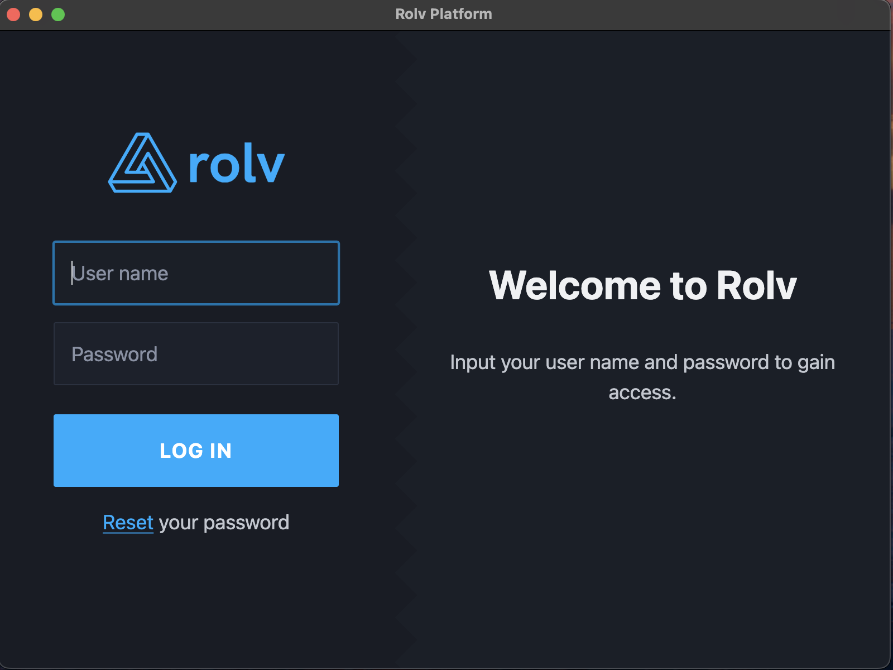


## Testing if R works
The next step is to let RolvDesktop know where it can find your R installment! A default path has already
been set for you, but this might not be the correct one.

To check if the app can find your R installation, click
Set R path in the Menu Bar. Then, by clicking Test R path, we can see if RolvDesktop can find your R
installation. If R is available, you should see a popup on the right side of the screen telling you that R is
working.

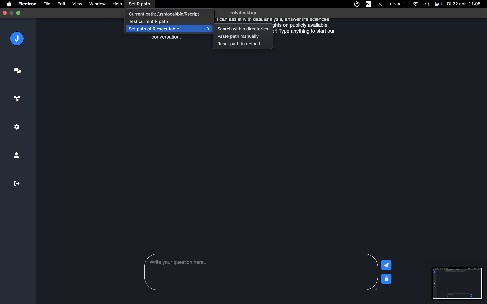


## If R is not Available or can not be found

If R is not available or can not be found at default locations, you will see an error pop up. 
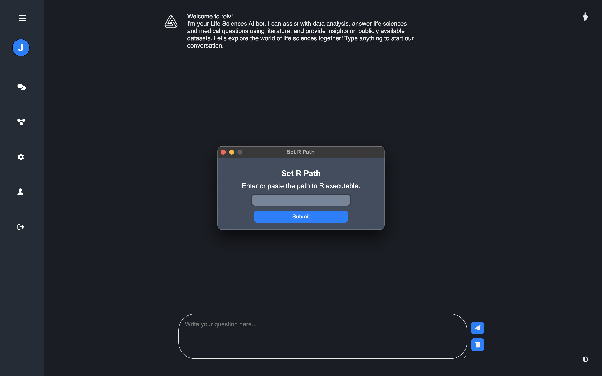


If this is the case, follow these steps to determine where
your R resides in your system:

1. First, we open up the terminal/PowerShell:
  - On Mac: Press Cmd + Space, type in Terminal, and press Enter.
  - On Linux: Press Ctrl + Alt + T to open the terminal.
  - On Windows: open PowerShell by pressing Win + X and selecting Windows PowerShell.
  
2. Now, we look for the Rscript file within the system:
  
    - On Mac/Linux type in the following command:
    
      `whereis Rscript`
    
      This should return the location of Rscript. Copy this path so we can paste this path into RolvDesktop.
    - On Windows type in the following command:
      ```{r eval=F}
       Get-ChildItem -Path C:\ -Recurse -Filter "Rscript.exe" -ErrorAction SilentlyContinue
      ```
    This should return the location of Rscript. However, we cannot just paste the path in there as is.
    Ensure that the C:\ is deleted, and all the backslashes \ are changed to forward slases / before
    pasting the path in the app.
  
  
Once you have located the path of Rscript, we can now let RolvDesktop know. To set the R path, go to
Set R path in the Menu bar. Then, press set path of R executable and select paste path manually.
A pop-up should now appear where you can paste the path to Rscript.
Paste the path to Rscript, click submit, and now R should be available to RolvDesktop! You can check this
by pressing Test R path again.

If everything is OK, you should now be able to see the main interface and should be able to start your journey.

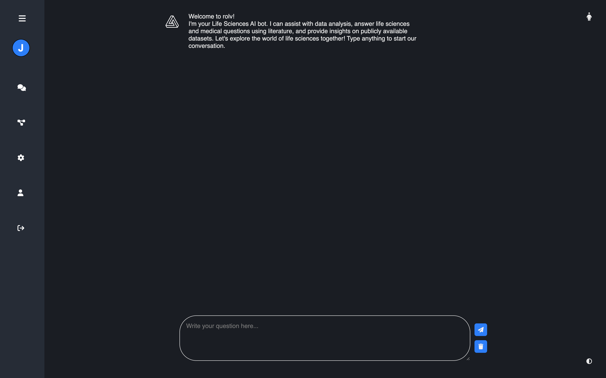


# Configuration & Preferences
Currently only important configuration you have to make is setting a working directory 
The app will look for the data mentioned in your prompts/questions in this directory. 
This is explained in detail below in the next section. 

The other options there are as follows (and also explained below):

  - **Activate auto execution** : any code that will be generated by rolv will immediately be executed automatically. 
  - **Activate file header addition** : This will add the first two lines of any files you mention in your question and send it to rolv app.
  - **Activate self-correct** : Currently not functional. It is intended to feed execution errors automatically to LLM and get corrected code. However, same functionality can be achieved on the chat interface by asking to correct the code when you receive an error.

# Usage Guide
## How to use the basic chat interface
To give you an example of the basic usage, we ask the bot to simulate data and 
do some basic analysis. Here is how it would look like:
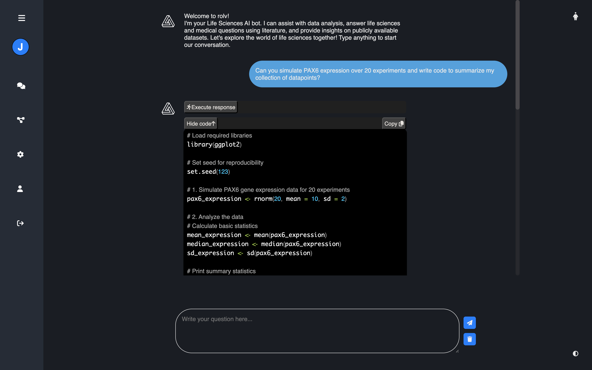


And here is the result of the simulation and analysis:
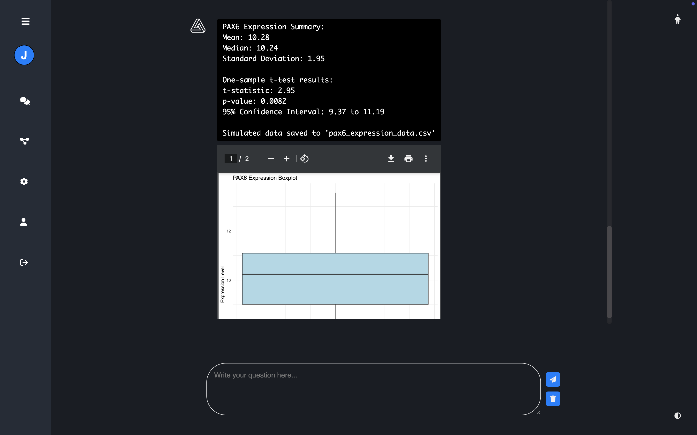


## Analyzing your data stored on your computer

While simulating data can be useful, analyzing real-world data is far more insightful. Fortunately, ROLV
can generate code based on files in your system. For example, if you have gene expression data stored in
gene_expression.txt, you can inform ROLV about the file, and it will tailor its code accordingly. To specify
the file’s location, simply open the Chat options menu from the left sidebar. A dropdown menu opens,
where we can press Select directory:

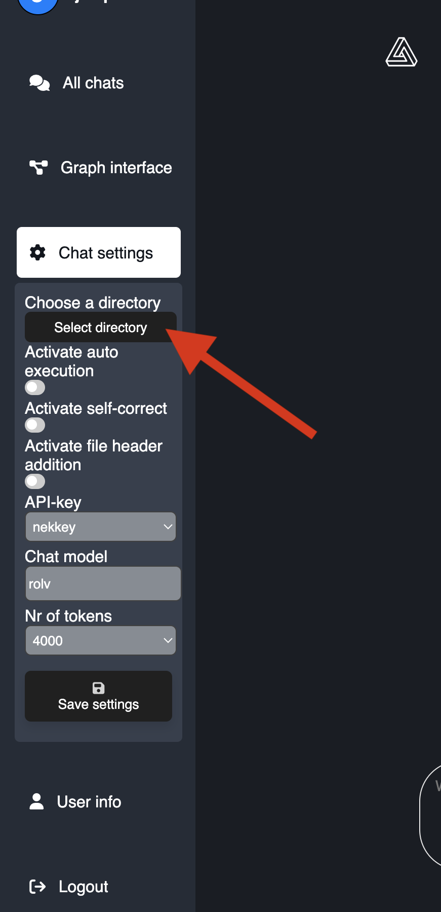


A file dialog will open, from which you can select the directory in which your files are. Any subdirectories
within that directory will also be searched. Once we have done this, we have a few other options that we can use.
When we turn on Activate auto execution, any code that will be generated by ROLV will immediately
be run. We can also turn on Activate file header addition. This will add the first two lines of any files
you mention in your question and send it to ROLV. For now, lets turn on Activate file header addition
and ask some questions about our file gene_expression.txt:


```{r eval=F}
I have a file called gene_expression.txt, which holds
gene expression data of different samples. Samples are on the
columns and genes are on the rows. Could you make a boxplot
of the average gene expression over different samples for
the first 5 genes?

```

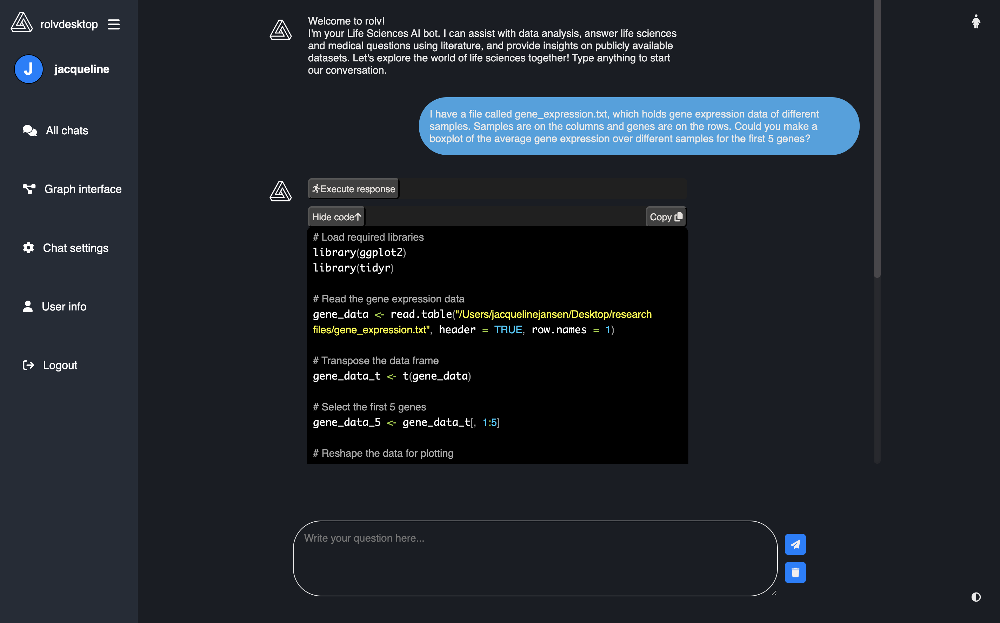

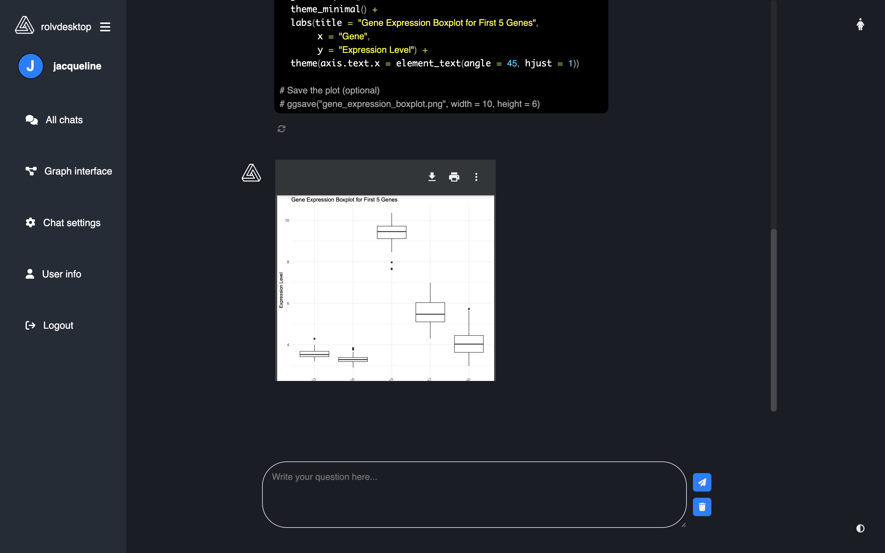


As we can see from the example above, the code that ROLV gives back is now based on the file mentioned in
our question! So we can ask questions and run code based on data that we have from our actual experiments!
But ROLV can not only summarize our data and give us a nice visual representation of it, we can also ask it
to do any other type of analysis for us. The possibilities are endless!

## Doing literature search

ROLV is not only able to assist you with writing coding pipelines, it is also able to help you during your literature
search. Let's say we quickly want to pull up some information on PAX6: we can ask ROLV to give us some usefull information
with links to PubMed articles:

```{r,eval=F}
Could you give me some information about PAX6 and its function within the cell?
```


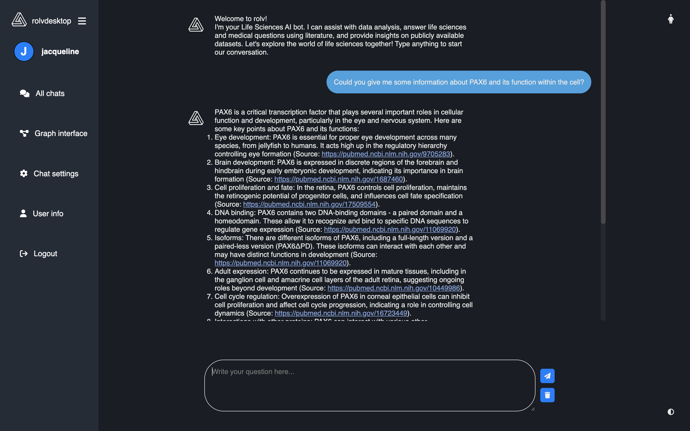

As you can see from the above screenshot, a whole list of articles is returned with information about PAX6 and its function within the cell.
There are also links provided to the articles so you can verify the information yourself, and use proper references to the actual articles
which the information came from!

## Doing data set search 


ROLV can also help you find relevant datasets directly within the app by integrating with public repositories such as GEO. This makes it easy to identify experimental data that matches your research context (e.g., tissue type, species, perturbation, or technology used).

one example question we could ask is the following:
```{r,eval=F}
Find me ChIP-seq datasets for TGFbeta in liver tissue.
```

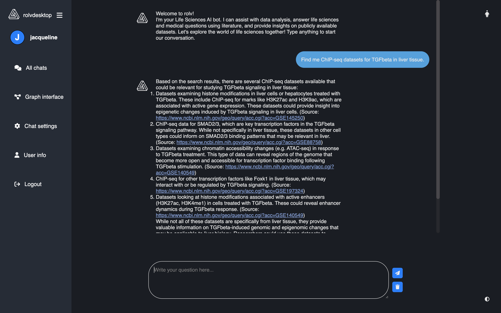

As shown above, ROLV will return a list of matching datasets with some additional information and links to the relevant datasets. You can click on the links provided to access the full dataset and metadata.

## AI-assisted workflow creation

ROLV allows you to build flexible, modular workflows that combine multiple data analysis steps—without having to manually code each component. Using the graph interface, you can create, edit, and execute complex pipelines visually or via chat.

To begin building such a pipeline, we can click the graph interface icon on the sidebar. This will open a graph interface containing a single node. From this node, we can either paste in some pre-existing code into the code interface, or start chatting via the chat with me button. 

Now that we are all set, let’s start the conversation, and ask the same question we asked before about our file
gene_expression.txt:

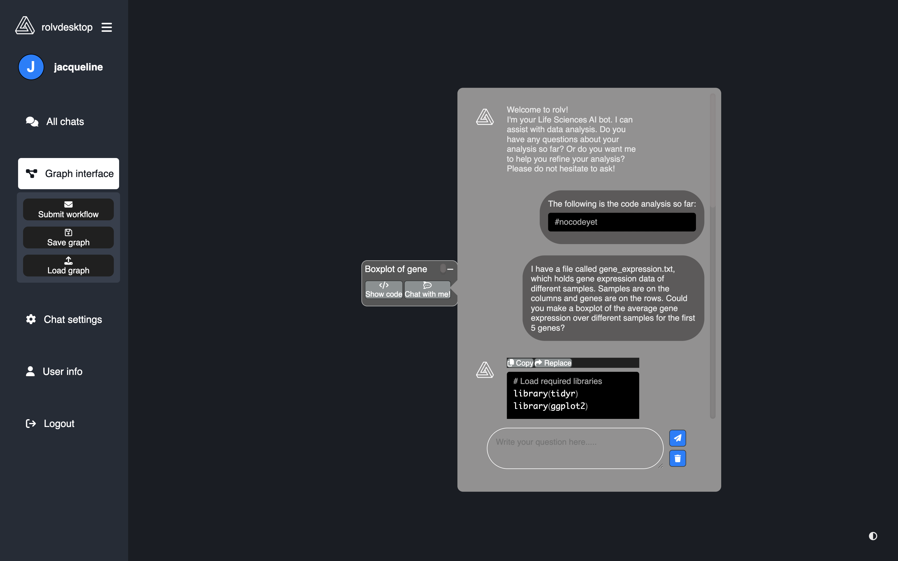

We get back an answer with code again! However, now instead of the button Execute code, we can see two other buttons on top of the answer: Copy and Replace. To understand what these buttons do, you can open the coding interface of the node by pressing the Show code button. For now, this is empty. However,watch what happens when you now click the Copy or Replace button. The code is copied over to the coding
interface, and now you can click the Execute code button to execute it and see the results! Here you can also change any existing code, or even make entire snippets yourself. 


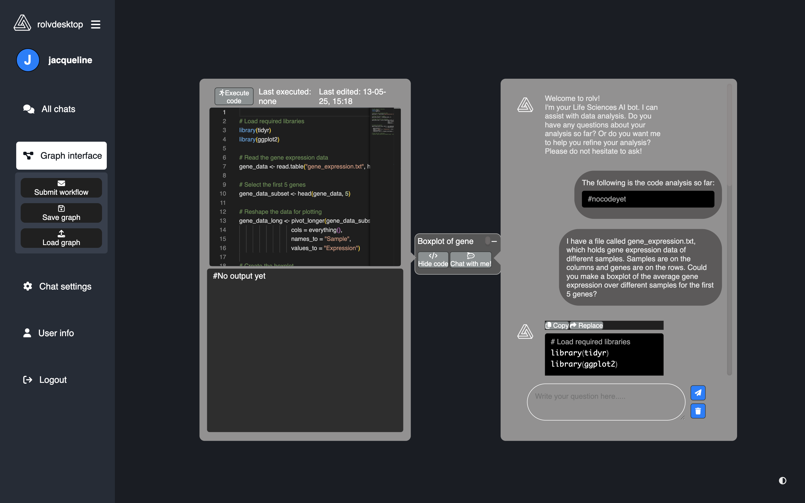

__Note:__ When the coding interface is empty, the buttons Copy and Replace will do the same thing. However,
if there already is some code present in the coding interface, Copy will just copy the code from ROLV to the
coding interface and paste it at the bottom. Pressing Replace however, will delete the existing code in the
interface, and replace it with the new code from ROLV. So be careful which one you press!


Now you might be thinking... is this not the exact same thing we did with the chat
interface? Yes and no! So far what we have done could also be done in the chat interface, but now lets add
another node to the graph! To do this, we first close the code and chat interfaces by clicking on the Hide
code and Chat with me button. You should see another black button with a white ‘+’ sign on the right side
of the node. Once you press this, ROLV will gather suggestions on what types of analysis you could do based
on the analysis that is already there. From this, you can choose on of the options that ROLV gives you, or
create an empty node and chat about the type of analysis you want done after your first node.

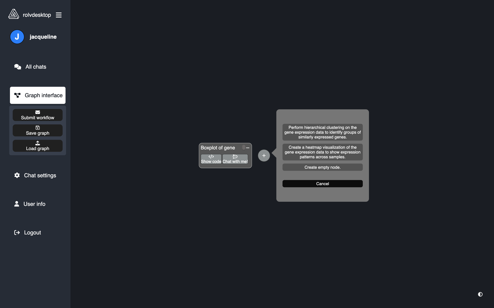

As you can see in the above image, we have 2 options to choose from: 

- Perform hierarchical clustering
- Create a heatmap visualization


Let’s press the second option and see what happens:
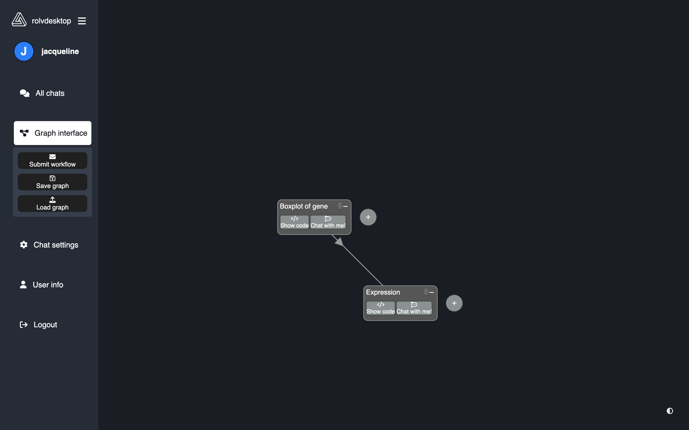


There is a new node added to the graph! If we now press on Show code, we can see that there already is
code present, showing us how to create a heatmap. When we now press Execute code, all the code from its
parental nodes (in this case our gene expression node) is first run, after which the code within the node itself
is run. If we open the chat interface by pressing Chat with me, we can view the full coding analysis as it
runs and chat with ROLV to ask questions or request modifications. However, if we know exactly what type
of modifications we want to make, we can also edit the code ourselves. 


## Ask A Human Feature: 

AI gets you far, but sometimes you need human expertise. When you’re stuck, we provide an option to connect with data analysis experts through our platform. As of currently, this feature will only work when you are in the main chat interface. If you are chatting with our AI assistant, but you are stuck on a problem, click on the human button on the top right corner of the screen:

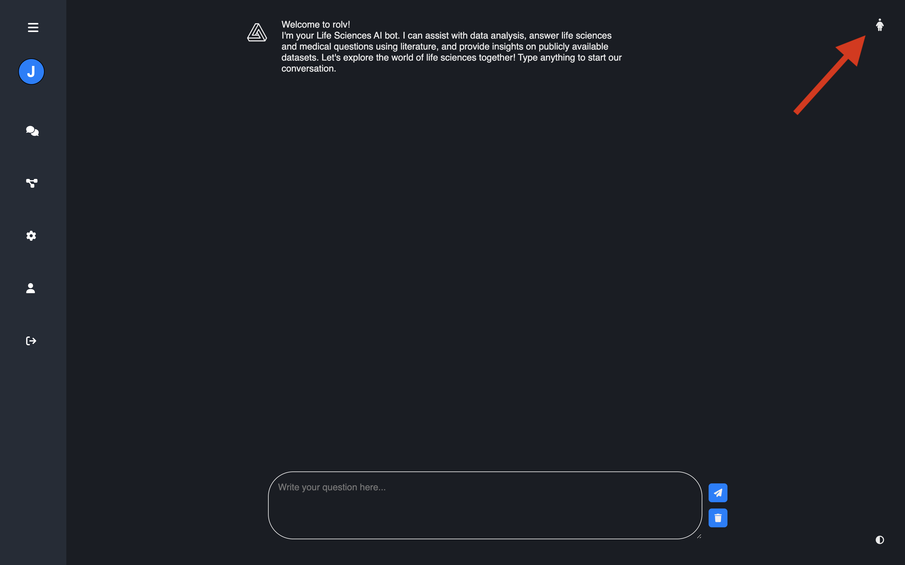


Clicking this will open the popup menu below. Here you can write your question about the currently open chat, and this will send you message to our data analysis experts together with your chat history. We will then get back to you as soon as possible!

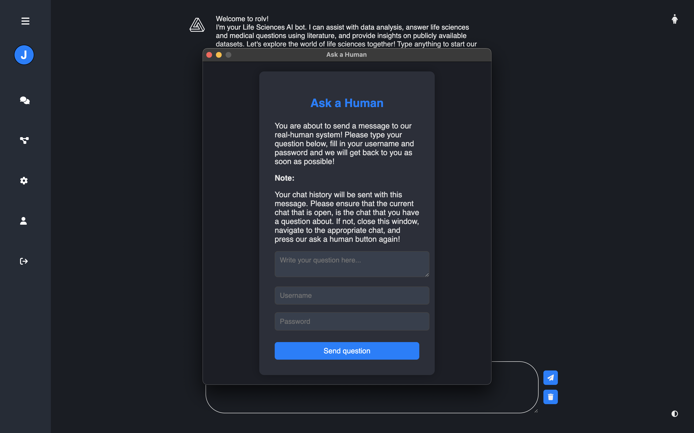

# FAQs & Troubleshooting


## How do I update the app?
The new versions are released via GitHub releases. The app will check if there 
are new versions available every time you start it.

## Does it work offline?
The app can not work offline as it requires connection to chat API.

## How to uninstall?
Here’s how to uninstall Electron-based apps on **Windows 11**, **macOS**, **Fedora**, and **Ubuntu**:

---

### **Windows 11**
#### **Method 1: Via Settings**
1. Open **Settings** (Win + I).
2. Go to **Apps → Installed Apps**.
3. Search for the RolvDesktop
4. Click the **⋮ (three dots)** next to the app → **Uninstall**.

#### **Method 2: Control Panel**
1. Open **Control Panel** → **Programs → Programs and Features**.
2. Right-click the app → **Uninstall**.


---

### **macOS**
#### **Method 1: Drag to Trash**
1. Open **Finder** → Go to **Applications**.
2. Drag the app to the **Trash** (or right-click → **Move to Trash**).
3. Empty the Trash.

#### **Method 2: Terminal**
```bash
sudo rm -rf /Applications/RolvDesktop.app
```


---

### **Fedora (Linux)**
#### **Method 1: If Installed via Package Manager (dnf/rpm)**
1. List installed packages:
   ```bash
   dnf list --installed | grep -i "RolvDesktop"
   ```
2. Uninstall:
   ```bash
   sudo dnf remove RolvDesktop
   ```


---

### **Ubuntu (Linux)**
#### **Method 1: If Installed via APT/.deb**
1. List installed packages:
   ```bash
   apt list --installed | grep -i "RolvDesktop"
   ```
2. Uninstall:
   ```bash
   sudo apt purge RolvDesktop
   ```

#### **Method 2: If Installed Manually (e.g., AppImage or .deb)**
- **AppImage**: Delete the file.
- **.deb**:
  ```bash
  sudo dpkg -r <package-name>
  ```


# Support & Feedback
## Contact: Email, forum, or GitHub link for support.

General contact: hello@rolv.io

Community forum: https://github.com/rolv-io/rolvapp/discussions/

## Bug Reports:

You can open bug reports here: https://github.com/rolv-io/rolvapp/issues

Please include screenshots and a detailed account of what's happening as well as 
toy data and prompts that reproduces the problem. Otherwise, we can't help you.

## Feature Requests: Process for suggesting improvements.
You can request features or share your ideas here: https://github.com/rolv-io/rolvapp/discussions/categories/ideas-feature-requests

# Updates & Maintenance
Auto-Update: App checks if there are new versions every time you restart it.
It is advised to keep an up-to-date version.

Manual Update: You can also check latest releases manually and update your app.

# Documentation for older versions
Currently no documentation exists for older versions. We will add those to this 
section as we release new versions.


